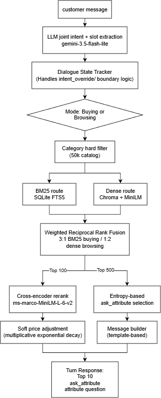

# CRIS — Conversational Recommender & Intelligent Search

**Team:** The Outliers · **Event:** TikTok TechJam 2026 · **Track:** Problem Statement 4 — Shopping Copilot: AI Conversational Search and Recommendations

CRIS is a multi-turn shopping agent for the TechJam Conversational E-Commerce Search Challenge. Given an anonymized customer profile and a short opening message, it asks useful clarification questions and returns ranked product recommendations, trying to surface the customer's hidden target product from a 50,000-item catalog within 10 conversational turns.

This README is the entry point into the repo. For the full write-up (project description, method, model choice, limitations, and cost/latency disclosure) see `CRIS_TechJam_Report.md` for a condensed, section-by-section outline of that report.

## Architecture



### State

`state/dialogue_state.py` holds a `DialogueState` per session, ten attribute slots plus a rejected list, refreshed each turn by `state/llm_extractor.py`'s single joint LLM call (intent and slots together). This is the joint-NLU pattern and takes roughly half the tokens and latency.

### Retrieval

`search.py` turns the current state into a category hard filter, which reduces the candidate pool before hybrid retrieval. `retrieval/pipeline.py` runs BM25 (sqlite3 FTS5) and dense (Chroma plus sentence-transformers) routes over what is left, fused with Reciprocal Rank Fusion (`retrieval/rrf.py`). Weighting is 3:1 toward BM25 in buying-mode and 1:2 toward dense in browsing-mode, since buying queries carry more explicit constraints while browsing queries are more vague.

### Reranking

The fused top-100 candidates go through a `cross-encoder/ms-marco-MiniLM-L-6-v2` cross-encoder (`reranker/reranker.py`) against a compact query (query is matched by `parent_asin` from `reranker_catalog`, which is a precomputed and compressed document of each product uniquely created for reranker.). If a target price is known, scores get a multiplicative exponential-decay adjustment: `exp(-|price - target_price| / (target_price × decay_rate))`. Missing prices score a neutral 1.0x.

### Entropy & Question Generation

`generation/weighted_entropy.py` scores each still-open attribute by expected reduction in candidate-pool uncertainty (`scipy.stats.entropy`). This score is further weighted by the customer’s `preference_tags`, distribution of the pool that declares the attribute (coverage), number of distinct attribute values (cardinality), frequency of the customer’s questions on an attribute (ANSWERABILITY), how many times the attribute has been asked (refusal_penalty).

### Response assembly and demo

`agent/message_builder.py` turns the chosen attribute and mode into a customer-facing message using a template. `frontend/app.py` (Streamlit) hosts a two-page demo: an evaluation dashboard and a live demo conversation with CRIS, including a pipeline-state inspector for explainability.

## Git Repository Tree
```bash
C:.
│   .gitignore
│   DATA_ATTRIBUTION.md
│   PROBLEM_STATEMENT.md
│   README.md
│   
├───artifacts
│   └───chroma
│               
├───data
│       catalog.jsonl
│       public_set.jsonl
│       public_set_5.jsonl
│       README.md
│       
├───docs
│       agent_api_contract.json
│       baseline_results.json
│       competition_specification.md
│       evaluation_config.json
│       submission_rules.md
│       
├───evaluator
│       local_evaluator.py
│       __init__.py
│           
├───scripts
│       build_chroma_store.py
│       get_prefs.py
│       reranker_catalog_parser.py
│       tune_rrf_weights.py
│       
└───submission
    │   agent.py
    │   README.md
    │   requirements.txt
    │   
    └───src
        │   .env
        │   
        ├───agent
        │       message_builder.py
        │       shopping_agent.py
        │       __init__.py
        │       
        │           
        ├───embed
        │       embedder.py
        │       product_text.py
        │       store.py
        │       __init__.py
        │           
        ├───frontend
        │   │   app.py
        │   │   
        │   ├───pages
        │   │       1_Evaluation.py
        │   │       2_Recommender_Demo.py
        │   │       
        │   └───utils
        │           pipeline_handler.py
        │           ui_helpers.py
        │               
        ├───generation
        │       measure_answerability.py
        │       tune_preference_tag.py
        │       weighted_entropy.py
        │       __init__.py
        │           
        ├───reranker
        │       reranker.py
        │       reranker_catalog.jsonl
        │       __init__.py
        │           
        ├───retrieval
        │       bm25.py
        │       catalog_ids.py
        │       pipeline.py
        │       rrf.py
        │       __init__.py
        │           
        ├───search
        │       search.py
        │       __init__.py
        │           
        └───state
                dialogue_state.py
                llm_client.py
                llm_extractor.py
                README_dialogue_state.md
                regex_extractor.py
                __init__.py
```

## Setup

Python 3.10+ recommended.

```bash
git clone https://github.com/iiank/The-Outliers-TikTok-TechJam-2026.git
cd The-Outliers-TikTok-TechJam-2026
python3 -m venv .venv && source .venv/bin/activate
pip install -r submission/requirements.txt
```

**Catalog.** Download `catalog.jsonl.gz` from the repo's GitHub Release, then:

```bash
gzip -dk catalog.jsonl.gz
mv catalog.jsonl data/catalog.jsonl
```

Verify against the published `SHA256SUMS` file before use.

**Vector store.** Build the local Chroma index once (and again whenever `data/catalog.jsonl` or the embedding model changes):

```bash
python submission/scripts/build_chromadb_store.py
```

This writes `artifacts/chroma/`, which is gitignored — every teammate builds their own copy locally.

**Reranker_catalog.** If products are required for evaluation outside of the provided `catalog.jsonl`, please run the following script to create the necessary precomputed reranker_catalog (with the file name changed to the new catalog)

```bash
python submission/src/reranker/build_reranker_catalog.py
```

**Credentials.** Create `submission/.env` with at least:

```text
LLM_API_KEY=GEMINI API KEY
```

```powershell
Remove-Item Env:LLM_REASONING_EFFORT -ErrorAction SilentlyContinue
$env:LLM_API_KEY = "gemini api"
$env:LLM_BASE_URL = "https://generativelanguage.googleapis.com/v1beta/openai"
$env:LLM_MODEL = "gemini-3.5-flash-lite"
$env:LLM_MAX_TOKENS = "512"
$env:LLM_MIN_INTERVAL = "8"
```

`LLM_API_KEY` is required — it powers the per-turn intent/slot extraction call and has no offline fallback. Optional overrides: `LLM_BASE_URL`, `LLM_MODEL` (defaults to Gemini’s `gemini-3.5-flash-lite`), `LLM_TIMEOUT`, `LLM_MAX_ATTEMPTS`, `LLM_REASONING_EFFORT`. Setting `ANTHROPIC_API_KEY` additionally enables the optional Claude Haiku (`claude-haiku-4-5`) message-phrasing path in `message_builder.py`. Note that this integration is currently non-functional and intended strictly for future development; without it, a deterministic template builder is used and no extra key is needed. Never commit `submission/.env` or any API key.

## Reproducing results

Run the official local evaluator against the 200 public dev sessions:

```bash
python -m evaluator.local_evaluator --output results_200.json
```

This writes per-session results and aggregate metrics (Hit Rate@10, MRR, MTTC, Efficiency, TechnicalScore — overall and per scenario) to `results.json`. It currently points at `submission/agent.py` (see the note at the top of `evaluator/local_evaluator.py`); the weak BM25 baseline in `starter/agent.py` scores Hit Rate@10 `0.125`, MRR `0.068034`, MTTC `9.81` for comparison (`docs/baseline_results.json`).

Run the interactive demo:

```bash
streamlit run submission/src/frontend/app.py
```

## Data

Derived from Amazon Reviews 2023 (McAuley Lab, UCSD), `Clothing_Shoes_and_Jewelry` category, joined on `parent_asin`. Text and structured metadata only — no images. See `DATA_ATTRIBUTION.md` before using or redistributing the data.

## Team Contributions

- **Erica Sim Wan Jing** - RRF Retrieval Pipeline, Target-price Scoring, Video script and voiceover
- **Joanne Koe Zi Xin** – Dialogue State Tracking, Regex Extractor, LLM client & context extraction
- **Kaylen Yeo** – Reranker via cross-encoder & reranker_catalog, Search API, Frontend StreamLit, Report
- **Khor Iian** - Embedding query, catalog, and public_set into Vector DB, Attribute selection with Weighted Entropy
- **Poon Yi Ming James** – Agent interface